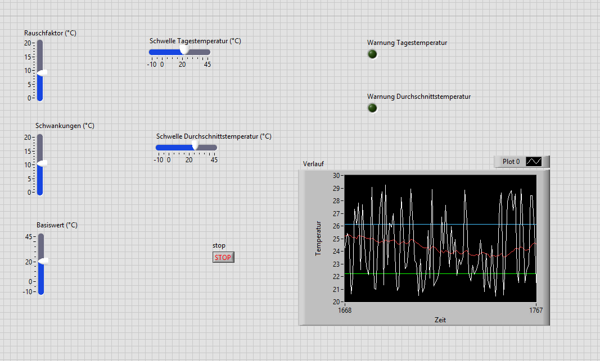
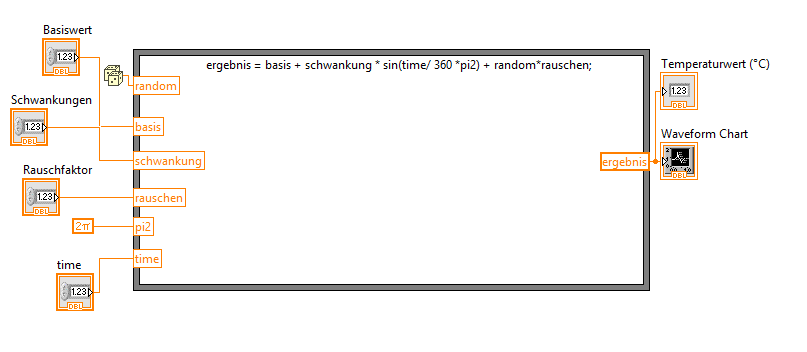

# 🌡️ LabVIEW Temperatur-Simulationsprojekt

Dieses Projekt simuliert Temperaturdaten mit Sinusmodulation und Rauschen, visualisiert die Ergebnisse in einem Verlaufschart und überprüft dabei Schwellenwerte für Tages- und Durchschnittstemperaturen. Es entstand als Lernprojekt zur strukturierten Anwendung von LabVIEW und ist als öffentliches Referenzprojekt zur Bewerbung in F&E gedacht.

## 🔧 Funktionen

- Temperatur-Simulation mit Schwankungen und Rauschen
- Visualisierung in Echtzeit (Waveform Chart)
- Schwellenwertüberprüfung für Tages- und Durchschnittstemperatur
- Modularer Aufbau über SubVIs
- Nutzersteuerung über das Frontpanel (z. B. Basiswert, Schwankung, Rauschfaktor)
- Warnanzeigen bei Grenzwertüberschreitungen

## 🔍 Vorschau



---

## 🧩 Modulübersicht

### 1. `simulate_temperature.vi`

> Simuliert eine Temperatur mit Sinusmodulation und additivem Rauschen.



[Details ansehen](docs/beschreibung_simulation.md)

---

### 2. `check_threshold.vi`

> Überprüft, ob aktuelle Tageswerte oder gleitende Durchschnittswerte Schwellen überschreiten.


[Details ansehen](docs/beschreibung_threshold.md)

---

## 🚀 Starten

1. Lade das Repository herunter oder klone es:
   ```bash
   git clone https://github.com/dein-nutzername/LabVIEW_Temperaturprojekt.git
