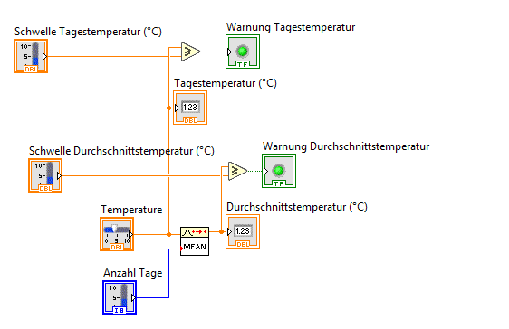

---

## 📄 `beschreibung_threshold.md`

```markdown
# check_threshold.vi

## 🎯 Zweck

Diese VI prüft, ob simulierte Temperaturwerte gewisse Grenzwerte überschreiten – sowohl **für einzelne Tageswerte** als auch **für Durchschnittswerte** über mehrere Tage hinweg.

Sie liefert zwei boolesche Signale als Warnung bei Überschreitung.

---

## 🔍 Funktionsweise

### Vergleichswerte:
- Tageswert > Schwelle Tag → **Tageswarnung aktiv**
- Mittelwert(Temperatur über N Tage) > Schwelle Durchschnitt → **Durchschnittswarnung aktiv**

Die Durchschnittsberechnung erfolgt per `MEAN.vi`.

---

## 🧰 Eingänge (Controls)

| Name                        | Typ       | Beschreibung                              |
|-----------------------------|-----------|--------------------------------------------|
| `Schwelle Tagestemperatur` | Numeric   | Grenzwert für einzelne Tageswerte (°C)     |
| `Schwelle Durchschnitt`    | Numeric   | Grenzwert für geglättete Durchschnittswerte |
| `Temperatur`               | Array     | Liste mit letzten Tageswerten (Shift Register) |
| `Anzahl Tage`              | Integer   | Wie viele Werte in Durchschnitt einfließen |

---

## 📤 Ausgänge (Indicators)

| Name                         | Typ     | Beschreibung                             |
|------------------------------|---------|-------------------------------------------|
| `Warnung Tagestemperatur`    | Boolean | `TRUE`, wenn Schwelle für Tageswert überschritten |
| `Warnung Durchschnittstemperatur` | Boolean | `TRUE`, wenn Mittelwert die Schwelle übersteigt |
| `Tagestemperatur (°C)`       | Numeric | Letzter Wert aus Temperatur-Array         |
| `Durchschnittstemperatur (°C)` | Numeric | Ergebnis der Mittelwertbildung            |

---

## 🔌 Integration

- Kann modular in andere Haupt-VIs eingebunden werden
- Liefert Warnsignale zur Steuerung von Alarmen, LEDs, Logging etc.

---

## 🖼 Beispiel


